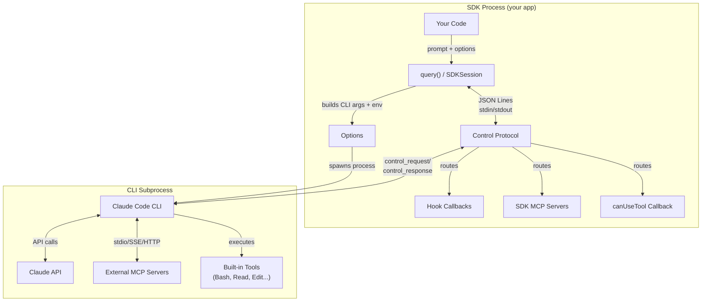
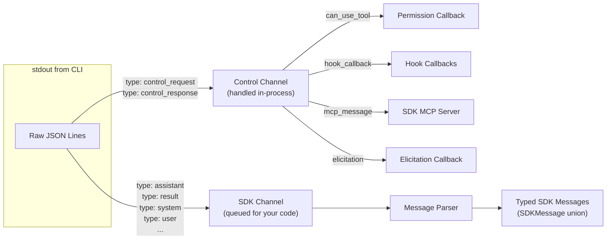
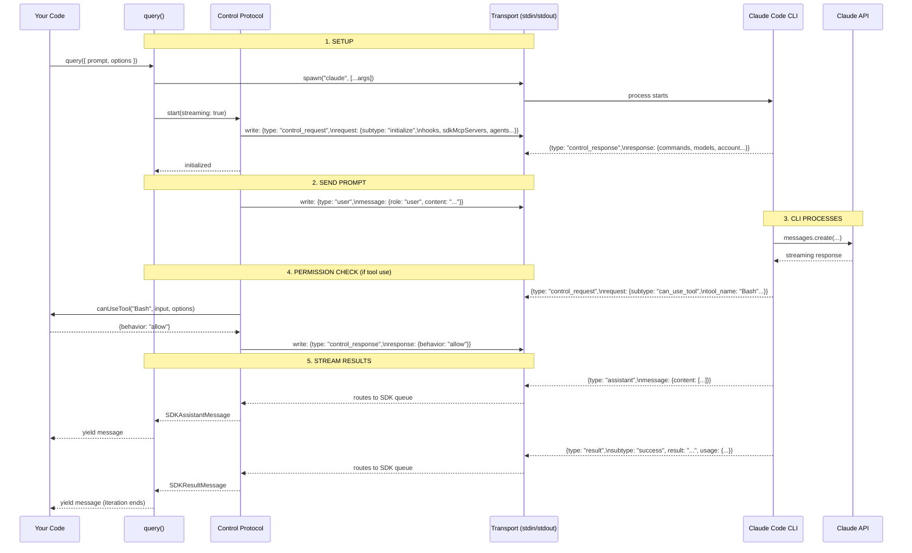
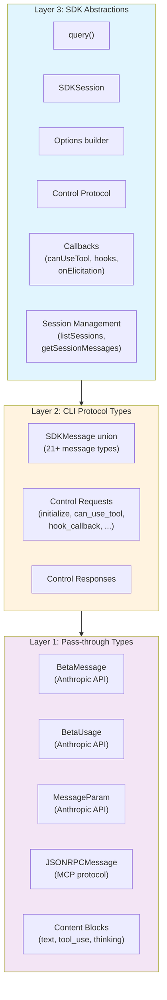

# TypeScript SDK Architecture: Data Flow

How data flows through the `@anthropic-ai/claude-agent-sdk`. Not about specific classes — about **concepts**, what they wrap, and where data lives.

## The Big Picture

The SDK is a **process bridge**. It spawns the Claude Code CLI as a subprocess and communicates over JSON Lines via stdin/stdout. Everything flows through this pipe.



## Two Message Channels on One Pipe

All messages flow through one stdin/stdout pipe, but the Control Protocol splits them into two logical channels:



## Data Flow: A Complete Turn



## What Wraps CLI Data vs. What's an SDK Abstraction

### SDK Abstractions

Invented by the SDK — not in the CLI's JSON protocol.

| Concept                | What it does                                                                                                            |
|------------------------|-------------------------------------------------------------------------------------------------------------------------|
| `query()`              | Entry point. Returns `AsyncGenerator<SDKMessage>`. Spawns process, runs handshake, sends prompt, yields typed messages. |
| `SDKSession`           | V2 multi-turn session interface. `.send()` / `.stream()` / `.close()`.                                                  |
| `Options`              | Converts user config into CLI args + env vars. The SDK's configuration surface.                                         |
| Control Protocol       | Routes messages between two channels. Manages request/response matching with IDs.                                       |
| `canUseTool`           | Permission callback. CLI sends a control request, SDK routes it to your function.                                       |
| `HookCallback`         | In-process hook execution. CLI sends hook input, SDK calls your function, returns result.                               |
| `createSdkMcpServer()` | Hosts an MCP server in your process. CLI routes MCP messages to it via control protocol.                                |
| `onElicitation`        | User input callback for MCP OAuth flows.                                                                                |
| Query methods          | `.interrupt()`, `.setModel()`, `.rewindFiles()`, `.setMcpServers()` — all send control requests.                        |
| `listSessions()`       | Reads the CLI's session JSONL files from disk. No subprocess involved.                                                  |
| `getSessionMessages()` | Parses the CLI's transcript format from disk.                                                                           |

### CLI Protocol Wrappers

Direct 1:1 mapping of JSON the CLI sends/receives. The SDK adds TypeScript types but doesn't transform the data.

| Type                                   | CLI JSON it wraps                                                                                            |
|----------------------------------------|--------------------------------------------------------------------------------------------------------------|
| `SDKAssistantMessage`                  | `{type: "assistant", message: BetaMessage}`                                                                  |
| `SDKUserMessage`                       | `{type: "user", message: MessageParam}`                                                                      |
| `SDKResultMessage`                     | `{type: "result", subtype: "success"\|"error_*"}`                                                            |
| `SDKSystemMessage`                     | `{type: "system", subtype: "init"}`                                                                          |
| `SDKStatusMessage`                     | `{type: "system", subtype: "status"}`                                                                        |
| `SDKPartialAssistantMessage`           | `{type: "stream_event", event: ...}`                                                                         |
| `SDKHookStarted/Progress/Response`     | Hook lifecycle messages                                                                                      |
| `SDKTaskStarted/Progress/Notification` | Subagent task messages                                                                                       |
| `SDKToolProgressMessage`               | Tool execution progress                                                                                      |
| `SDKRateLimitEvent`                    | Rate limit state changes                                                                                     |
| `SDKCompactBoundaryMessage`            | Context compaction markers                                                                                   |
| `SDKFilesPersistedEvent`               | File checkpoint events                                                                                       |
| `SDKElicitationCompleteMessage`        | MCP elicitation completion                                                                                   |
| `SDKPromptSuggestionMessage`           | Predicted next prompt                                                                                        |
| Control request/response types         | `initialize`, `can_use_tool`, `hook_callback`, `mcp_message`, `interrupt`, `set_model`, `rewind_files`, etc. |

### Configuration Wrappers

SDK types that map to CLI flags, env vars, or config JSON.

| SDK Type               | Maps to                                      |
|------------------------|----------------------------------------------|
| `PermissionMode`       | `--permission-mode` flag                     |
| `McpStdioServerConfig` | MCP server config JSON                       |
| `AgentDefinition`      | `--agents` JSON config                       |
| `SandboxSettings`      | `--sandbox-settings` JSON                    |
| `OutputFormat`         | `--output-format` config                     |
| `ThinkingConfig`       | `--thinking` / `--max-thinking-tokens`       |
| `SystemPrompt`         | `--system-prompt` / `--append-system-prompt` |
| `SettingSource`        | `--settings-sources` flag                    |

### Pass-through Types

Types from upstream protocols that flow through untouched. The SDK re-exports them for convenience.

| Type                        | Source                                        |
|-----------------------------|-----------------------------------------------|
| `BetaMessage`               | `@anthropic-ai/sdk` (Anthropic API response)  |
| `BetaUsage`                 | `@anthropic-ai/sdk` (token counts from API)   |
| `MessageParam`              | `@anthropic-ai/sdk` (API input format)        |
| `BetaRawMessageStreamEvent` | `@anthropic-ai/sdk` (streaming chunks)        |
| `JSONRPCMessage`            | `@modelcontextprotocol/sdk` (MCP wire format) |
| `CallToolResult`            | `@modelcontextprotocol/sdk` (MCP tool output) |
| `ElicitResult`              | `@modelcontextprotocol/sdk` (MCP user input)  |

## The Three Layers



**Layer 1 (Pass-through):** Types from the Anthropic API and MCP protocol. The CLI's `SDKAssistantMessage.message` is literally a `BetaMessage` from the API. The SDK doesn't interpret content blocks — they're whatever the API returned.

**Layer 2 (CLI Protocol):** The JSON shapes the CLI sends/receives over JSON Lines. The SDK defines TypeScript types for them but doesn't transform the data. It's a typed window into what the CLI emits.

**Layer 3 (SDK Abstractions):** Things the SDK invents. `query()` is not a CLI concept — it's an ergonomic wrapper that spawns a process, runs the control protocol handshake, sends the prompt, and yields typed messages. The Control Protocol's routing logic is an SDK concept. The CLI just sends a control request and blocks until it gets a response.

## Key Insight: The SDK is Thin Where It Matters

The SDK deliberately avoids re-interpreting CLI data. It doesn't parse content blocks into rich objects, doesn't build conversation trees, doesn't accumulate state. It's a **typed streaming bridge**:

```
Your prompt --> Options --> CLI args --> subprocess --> JSON Lines --> typed messages --> your code
                                            ^                              |
                                            +-- control requests <---------+
                                                (permissions, hooks, MCP)
```

The "intelligence" lives in three places:
1. **The CLI** — runs Claude, manages tools, handles the API
2. **The Control Protocol** — routes bidirectional requests between CLI and your callbacks
3. **Your code** — decides permissions, handles hooks, processes messages
